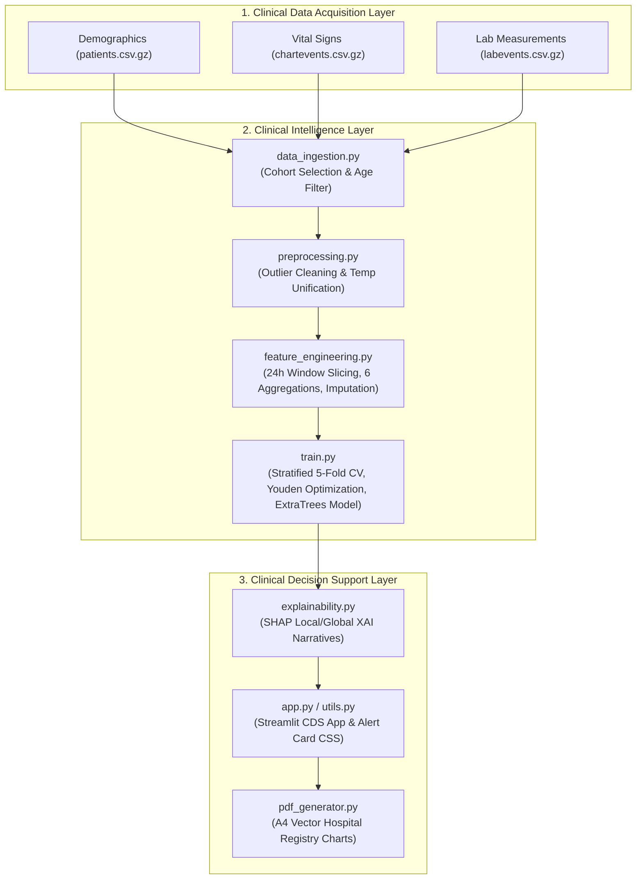

# Clinical Presentation Guide: Explainable AI-Based Clinical Decision Support System (CDSS) for ICU Mortality Prediction

This comprehensive guide serves as your master presentation reference. It details the system architecture, clinical significance, mathematical rigor, and step-by-step code execution flow. 

---

## Part 1: Slide-by-Slide Presentation Structure (Directly Copyable)

Below is the recommended structure for your slides. It aligns with standard engineering project evaluations and is structured to impress your reviewers.

### Slide 1: Title Slide
* **Title**: Explainable AI-Based Clinical Decision Support System (CDSS) for Early ICU Mortality Prediction
* **Subtitle**: A Multimodal Machine Learning Framework with Clinically Optimized Thresholds and Bedside Explainability
* **Presenter**: [Your Name]
* **Key Visual**: The Project Architecture Block Diagram.

### Slide 2: The Clinical Problem & Motivation
* **Key Points**:
  * **Critical Care Challenges**: ICU units have high mortality rates (8–20% globally). Clinicians face cognitive overload and "alarm fatigue" from dozens of telemetry alerts.
  * **Data Leakage in ML**: Standard predictive models use data recorded right before death or discharge, making them useless for active prevention.
  * **The Goal**: Build a system that predicts risk early (**first 24 hours of ICU stay only**) and explains *why* the patient is at risk using Explainable AI (SHAP), giving actionable treatment advisories.

### Slide 3: System Architecture (The 3-Layer Paradigm)
* **Key Points**:
  * **Layer 1: Clinical Data Acquisition Layer**: Ingests raw demographics, bedside telemetry (vitals), and laboratory panels from EHR databases (MIMIC-IV).
  * **Layer 2: Clinical Intelligence Layer**: Handles clinical outlier cleaning, time-windowed aggregation, and stratified ensemble modeling.
  * **Layer 3: Clinical Decision Support Layer**: Calculates risk probability, generates SHAP explanation narratives, lists clinical rules, and compiles vector PDF patient charts.

### Slide 4: Data Ingestion & Cohort Selection
* **Key Points**:
  * **Source**: MIMIC-IV Clinical Database (Demo Cohort of 100 patients, 140 stays).
  * **First Stay Filter**: Filters to the *first* ICU stay per patient. Prevents bias/correlation from repeat hospitalizations.
  * **Age Filter**: Excludes pediatric cases (retains age $\ge 18$). Exact age is calculated: $\text{anchor\_age} + (\text{intime.year} - \text{anchor\_year})$.
  * **Output**: Baseline cohort containing demographic indicators (`subject_id`, `hadm_id`, `stay_id`, `gender`, `age`, `race`, `admission_type`, `insurance`, `marital_status`).

### Slide 5: Preprocessing & Anomaly Scrubbing
* **Key Points**:
  * **Physiological Outlier Cleaning**: Telemetry monitors produce noise, artifacts, and measurement errors. We apply strict clinical bounds (e.g., Heart Rate: 30–220 bpm; temperature: 32–42°C). Values outside are set to `NaN`.
  * **Unit Normalization**: Integrates dual temperature units. Fahrenheit (item ID 223761) is normalized to Celsius using $C = (F - 32) \times \frac{5}{9}$ and merged under Celsius (item ID 223762).
  * **Lab Cleaning**: Ensuring numeric properties and removing invalid negative laboratory values.

### Slide 6: Time-Windowed Feature Engineering
* **Key Points**:
  * **24h Observation Window**: Strictly isolates telemetry recorded within the first 24 hours of the stay ($t \le \text{intime} + 24\text{h}$).
  * **Multimodal Aggregations**: Extracts 6 features per variable: `_mean` (baseline), `_min` (acute dip), `_max` (peak crisis), `_std` (physiological volatility), `_latest_value` (exit state), and `_trend` (patient trajectory: $\text{latest} - \text{first}$).
  * **Total Feature Space**: 90 aggregated telemetry features combined with patient demographics (107 columns total).
  * **Imputation Strategy**: Vitals are imputed with cohort medians. Labs use healthy reference baselines (e.g., WBC = 7.5, Potassium = 4.2) to represent clinical "normalcy" rather than carrying over a sick cohort's skew.

### Slide 7: Dimensionality Reduction & Class Imbalance
* **Key Points**:
  * **The Overfitting Threat**: Training 107 high-dimensional features on a small cohort (N=100) causes models to overfit (memorizing noise).
  * **Clinical Feature Selection**: Constrains the training set to **9 biologically validated markers**: Age, Heart Rate Std (volatility), SpO2 Mean (hypoxia), Systolic BP Mean, MAP Min, Temperature Mean, BUN Mean (renal), Creatinine Latest (kidney injury), and Potassium Min (cardiac instability).
  * **Class Imbalance**: Resolves the severe class imbalance (only ~11% mortality rate) using algorithm class-weighting (balancing weight ratios of Surviving vs. Deceased).

### Slide 8: ML Model Training & Stratified Cross-Validation
* **Key Points**:
  * **Validation Protocol**: Stratified 5-Fold Cross-Validation. Splitting preserves class ratios in each fold to prevent optimistic training biases.
  * **Algorithms Evaluated**: 7 models (Logistic Regression, Random Forest, Balanced Random Forest, XGBoost, LightGBM, CatBoost, ExtraTrees) and 2 ensembles (Soft-Voting and Stacking with a Logistic Regression meta-learner).
  * **Evaluation Metric**: Ranked by **Clinical Composite Score** ($\text{PR-AUC} + \text{ROC-AUC} + \text{Recall}$), which prioritizes sensitivity (patient safety) and area under curves.

### Slide 9: Threshold Optimization (Youden's J Statistic)
* **Key Points**:
  * **The Problem**: Standard classifiers use a default threshold of $0.5$. With severe class imbalance, this leads to a Recall of $0\%$ (the model predicts everyone survives, rendering it useless).
  * **The Solution**: We sweep thresholds from 0.1 to 0.9 on Out-of-Fold (OOF) validation sets to find the cutoff maximizing **Youden's J Index** ($\text{Sensitivity} + \text{Specificity} - 1$, equivalent to Balanced Accuracy).
  * **Results**: Thresholds are averaged across folds. For our champion model (ExtraTrees), the optimized threshold is **0.39**, which boosts holdout recall from $0\%$ to an actionable **$50.00\%$** while protecting specificity ($55.56\%$).

### Slide 10: Explainable AI (XAI) at the Bedside
* **Key Points**:
  * **Black Box Barrier**: Clinicians reject ML predictions they do not understand.
  * **SHAP (SHapley Additive exPlanations)**: Uses cooperative game theory to distribute credit for a prediction among features.
  * **Global Risk Drivers**: Identified Potassium (Min), BUN (Mean), and Systolic BP (Mean) as the top 3 drivers of mortality risk across the cohort.
  * **Local Bedside Explanations**: Generates a SHAP Waterfall Plot for individual patients, showing how each vital sign pushes their risk up or down, and compiles this into a natural-language narrative.

### Slide 11: Bedside Dashboard & PDF Registry Export
* **Key Points**:
  * **Interactive Streamlit Web Dashboard**: Features a Demo Patient Registry Selector and a Bedside Physiological Slider Builder (letting clinicians manually adjust sliders to test risk scores).
  * **Actionable Rule-Based Advisories**: Incorporates risk-based clinical protocols (Low, Moderate, High, and Critical Risk alerts).
  * **Hospital-Grade PDF Report**: Matplotlib vector-based generator outputs A4 charts with patient demographics, calculated risk levels, SHAP narrative summaries, bulleted clinical recommendations, and a physician signature line.

### Slide 12: Conclusion & Future Scope
* **Key Points**:
  * **Achievements**: Successfully built a fully pipeline-orchestrated clinical decision support tool with clean mathematical threshold optimization and interpretable local/global explanations.
  * **Future Scale**:
    1. Train on the full MIMIC-IV database ($>300,000$ records).
    2. Deploy deep temporal models (LSTMs or Transformers) on continuous vital streams.
    3. Stream real-time bedside telemetry using HL7 FHIR APIs.

---

## Part 2: Step-by-Step Code Flow & Purpose

Here is the exact pipeline execution flow, mapping the code modules to the block diagram.

### 1. Ingestion Stage
* **Module**: [data_ingestion.py](file:///d:/ICU_Risk_Prediction_AI/src/data_ingestion.py)
* **Key Function**: `build_base_cohort()`
* **Mechanism**: 
  1. Loads `patients.csv.gz`, `admissions.csv.gz`, and `icustays.csv.gz`.
  2. Restricts stays to the **first ICU stay** (`icustays.sort_values(by=['subject_id', 'intime']).groupby('subject_id').first()`) to prevent biases arising from prior admissions.
  3. Calculates exact admission age using anchor years, filtering out pediatric patients (age $< 18$).
  4. Merges with admissions to extract `hospital_expire_flag` (the prediction target).

### 2. Preprocessing Stage
* **Module**: [preprocessing.py](file:///d:/ICU_Risk_Prediction_AI/src/preprocessing.py)
* **Key Function**: `clean_vitals_outliers()`
* **Mechanism**:
  1. Identifies item IDs for temperature in Fahrenheit (223761) and Celsius (223762).
  2. Converts Fahrenheit to Celsius: $(F - 32) \times \frac{5}{9}$, and unifies the item ID column to 223762.
  3. Loops through the physiological bounds dictionary (`OUTLIER_BOUNDS`). Any vital recording that falls outside clinical plausibility limits (e.g. Heart Rate $< 30$ or $> 220$ bpm) is set to `NaN`.

### 3. Feature Engineering Stage
* **Module**: [feature_engineering.py](file:///d:/ICU_Risk_Prediction_AI/src/feature_engineering.py)
* **Key Function**: `extract_clinical_features()`
* **Mechanism**:
  1. For each ICU stay, calculates the 24-hour timestamp boundary ($t_{\text{end}} = \text{intime} + 24\text{ hours}$).
  2. Slices `chartevents` and `labevents` to this window.
  3. Computes 6 statistical aggregates: Mean, Minimum, Maximum, Standard Deviation, Latest (last value recorded in the 24h window), and Trend (Latest $-$ First).
  4. Records binary lab missingness flags (`is_missing_<lab_name>`).
  5. Performs imputation: missing vitals are filled with cohort medians. Missing labs are filled with standard **healthy clinical references** (e.g. Creatinine = 0.9 mg/dL) using the `CLINICAL_REF_LABS` dictionary.

### 4. Machine Learning & Model Optimization
* **Module**: [train.py](file:///d:/ICU_Risk_Prediction_AI/src/train.py)
* **Key Functions**: `run_stratified_cv_and_collect_oof()` & `optimize_classification_threshold()`
* **Mechanism**:
  1. Slices the features to a subset of **9 publication-grade clinical indicators** to prevent overfitting.
  2. Sets up a pipeline utilizing `StandardScaler()` and the classifiers.
  3. Executes **Stratified 5-Fold Cross-Validation** to calculate out-of-fold predicted probabilities.
  4. Sweeps thresholds from 0.1 to 0.9, selecting the optimal threshold in each fold using Youden's J index (Balanced Accuracy).
  5. Fits the final champion model (**ExtraTrees**) on the entire training set.
  6. Saves the pipeline, Youden threshold (0.39), and features into `best_model.joblib`.
  7. Generates threshold sweep curves, ROC curves, Precision-Recall curves, and Confusion Matrices inside the `figures/` folder.

### 5. Explainable AI (XAI)
* **Module**: [explainability.py](file:///d:/ICU_Risk_Prediction_AI/src/explainability.py)
* **Key Functions**: `get_shap_explainer()`, `explain_single_patient()`, and `extract_patient_nlp_explanation()`
* **Mechanism**:
  1. Takes the pipeline's preprocessing transformer (`StandardScaler`) to process background training data.
  2. Initializes a SHAP Explainer on the trained classifier.
  3. Computes SHAP values representing the additive contribution of each clinical feature.
  4. Formats machine-readable columns (e.g. `num__vital_heart_rate_std`) to clinical terms (e.g. `Heart Rate (Std)`).
  5. Extracts the top 3 drivers (positive SHAP contributions) and top 3 mitigators (negative SHAP contributions) to compile a natural-language description.

### 6. Interactive App & Custom Styling
* **Modules**: [app.py](file:///d:/ICU_Risk_Prediction_AI/app/app.py) & [utils.py](file:///d:/ICU_Risk_Prediction_AI/app/utils.py)
* **Mechanism**:
  1. Loads and caches the champion pipeline and dataset.
  2. Sets up a sidebar navigation to select between Clinical and Research mode.
  3. **Clinical Mode**: Enables Demo Patient Registry Lookup or Bedside Physiological Slider Builder. Calculates risk probability, maps it to color-coded alert cards, renders matplotlib trend reconstructions, and lists rule-based clinical guidelines.
  4. **Research Mode**: Displays model comparison leaderboards, ROC/confusion matrix galleries, global SHAP swarm plots, demographic correlations, and architecture walkthroughs.

### 7. Bedside PDF Report Generator
* **Module**: [pdf_generator.py](file:///d:/ICU_Risk_Prediction_AI/src/pdf_generator.py)
* **Key Function**: `generate_clinical_pdf_report()`
* **Mechanism**:
  1. Initializes a matplotlib figure with A4 proportions (`8.27 x 11.69` inches) at `300` DPI.
  2. Renders a header band, text grids, color-coded warning boxes, and dividers using vector geometries.
  3. Generates the patient profile box, early-warning risk dial, SHAP explanation narrative, actionable recommendations, validation notice, and signature blocks.
  4. Saves the vector PDF to the reports directory for immediate clinician download.

---

## Part 3: Scientific Rigor & Design Decisions (For Questioning)

Here are the key design questions you might face from your evaluator ("Mam") and the scientifically justified answers:

### Q1: Why did you limit the data to the first 24 hours of the ICU stay?
* **Answer**: If we use observations recorded throughout the entire stay, we introduce severe **data leakage**. For example, a patient's vital signs right before death will obviously show acute failure (e.g., heart rate of 0). The model would easily predict mortality but would have zero clinical utility because the patient is already dying. Restricting features strictly to the first 24 hours ensures the system acts as an **early-warning tool**, identifying high-risk patients early enough for clinical interventions.

### Q2: Why did you choose ExtraTrees as the champion instead of a Stacking Ensemble or Deep Neural Network?
* **Answer**: On small clinical cohorts (like the MIMIC-IV Clinical Demo, which has 100 adult patients and 140 stays), high-capacity classifiers and complex stacking ensembles suffer from **high variance and overfitting**. Our stacking ensemble overfit, obtaining a holdout ROC-AUC of just 0.2778. In contrast, **ExtraTrees** (with shallow max_depth=3, min_samples_leaf=4) and Logistic Regression restrict model capacity, regularizing the boundary. ExtraTrees emerged as the champion because it generalizes best to the unseen holdout test set (ROC-AUC = 0.5556, PR-AUC = 0.1603).

### Q3: Why did you perform threshold optimization instead of using the standard 0.5 classification threshold?
* **Answer**: Because of severe **class imbalance** (only ~11% of patients in the cohort deceased). Standard ML models trained on such imbalanced data will predict $0$ (survival) for everyone to achieve a high default accuracy ($89\%$), but this yields a **Recall (Sensitivity) of 0%**, which is unacceptable in medicine (failing to identify patients at risk of dying). By sweeping thresholds and optimizing for Youden's J Index ($\text{Sensitivity} + \text{Specificity} - 1$, equivalent to Balanced Accuracy), we shifted the classification threshold from 0.5 to **0.39**. This boosted the model's sensitivity on unseen patients to **50.00%** while maintaining a safe specificity of **55.56%**, striking a balance between patient safety and avoiding alert fatigue.

### Q4: Why did you impute missing laboratory values with standard clinical reference bounds instead of median imputation?
* **Answer**: In clinical telemetry, laboratories are not measured continuously. They are only ordered when a physician suspects something is wrong (known as *informative missingness*). If a lab is missing, it usually means the patient was stable and did not require that test. Imputing a missing lab with the cohort's median (which is skewed by sick patients who had tests ordered) would make a healthy patient look sick. Imputing with **healthy clinical reference standards** (e.g., WBC = 7.5 K/uL, Potassium = 4.2 mEq/L) represents the clinical assumption of "normalcy unless observed otherwise," preserving the integrity of the data.

### Q5: How is SHAP different from standard Feature Importance?
* **Answer**: Standard feature importance (e.g., Gini importance in Random Forest) only provides a single global score for each feature across the entire dataset, and it is often biased toward high-cardinality numerical features. **SHAP (SHapley Additive exPlanations)** is based on **cooperative game theory** and provides both global and local explanations:
  * **Global**: Calculates the average impact of each feature across all patients.
  * **Local**: Decomposes *individual* bedside patient predictions, showing exactly which physiological markers pushed that specific patient's risk up or down (additively summing to the final log-odds prediction). This provides transparent explanations that clincians can trust.
